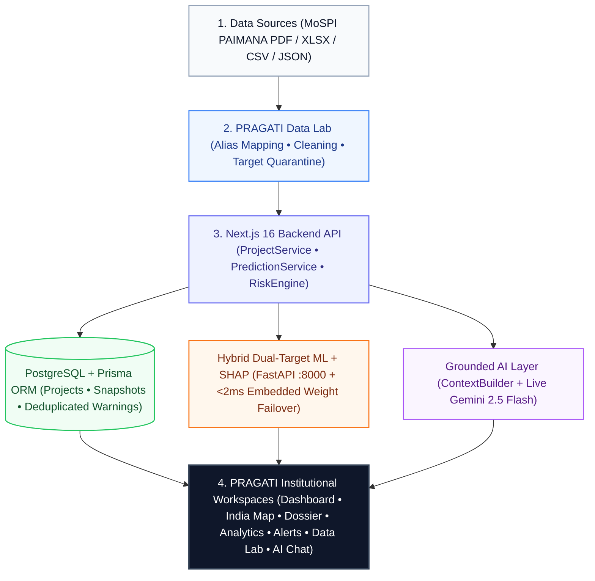

# PRAGATI: Predictive Infrastructure Monitoring and Analytics for Project Risk
An intelligent predictive analytics, early warning, and grounded decision-support platform for national infrastructure project monitoring (₹150 Cr+ central sector assets), aligned with **MoSPI PAIMANA / OCMS** tracking conventions.

---

## 1. Project Purpose & Vision

Large-scale national infrastructure initiatives frequently encounter compounding schedule slippages and capital budget escalations that traditional reporting identifies only *after* thresholds are breached. **PRAGATI** (*Predictive Infrastructure Monitoring & Analytics* / *Pro-Active Governance And Timely Implementation*) acts as an AI-powered **Early Warning System (EWS)**—analyzing monthly physical progress, financial expenditure burn rates, and milestone delivery trajectories to flag cost and schedule overrun risks months before bottlenecks become irreversible.

---

## 2. System Architecture & End-to-End Flow



### Step-by-Step Execution Flow

| Stage | Layer | What Happens |
| :--- | :--- | :--- |
| **Step 1** | **Ingestion & Anti-Leakage** | Official MoSPI PAIMANA reports (`PDF`, `XLSX`, `CSV`, `JSON`, `TXT`) are parsed, mapped to the 19 canonical fields, cleaned, and stripped of post-completion outcome columns. |
| **Step 2** | **Hybrid Dual-Target ML** | [`mlClient`](lib/ml-client.ts) calls the FastAPI microservice (`:8000`) or seamlessly fails over in `<2ms` to [`lib/ml-local-engine.ts`](lib/ml-local-engine.ts) using the exact trained `.joblib` weights ([`exported_weights.json`](ml/models/exported_weights.json)) to compute **Cost Overrun** (`Logistic Regression`) and **Schedule Delay** (`Random Forest`) probabilities + **Local SHAP drivers**. |
| **Step 3** | **Deduplicated Risk Rules** | [`RiskEngine`](lib/risk-engine.ts) evaluates 4 deterministic rules (`COST_OVERRUN_RISK`, `SCHEDULE_DELAY_RISK`, `EXPENDITURE_BURN_ANOMALY`, `CRITICAL_MILESTONE_SLIPPAGE`) and deduplicates active alerts per project in PostgreSQL. |
| **Step 4** | **Grounded AI & Workspaces** | [`ContextBuilder`](lib/ai/context-builder.ts) packages verified telemetry, SHAP drivers, and state/sector insights into `<untrusted_retrieved_data>` for **Google Gemini 2.5 Flash**, rendering results across the 7 interactive dashboard workspaces. |

---

## 3. Key Platform Capabilities

> [!NOTE]
> ### Production & Validated Capabilities
> - **PRAGATI Data Lab (`/dashboard/data-lab`)**:
>   - Multi-format ingestion engine supporting **official MoSPI PAIMANA Flash Report PDFs**, **Excel spreadsheets (`.xlsx`)**, **CSV**, **JSON**, and **Text/Markdown dossiers**.
>   - **3-Tier Official Data Checklist**: `10 Core Required Fields` (directly from MoSPI Flash Reports), `5 Auto-Derived PAIMANA Fields` (`implementing_agency`, `contractor_name`, `physical_progress_pct`, `terrain_type`, `environmental_clearance_status`), and `4 Optional Telemetry Fields`.
>   - **Zero-Downtime Real ML Scoring**: Runs live dual-target ML inference via FastAPI (`ML_SERVICE_URL`) and automatically fails over to [`lib/ml-local-engine.ts`](lib/ml-local-engine.ts) using the exact exported `.joblib` weights ([`ml/models/exported_weights.json`](ml/models/exported_weights.json)) so predictions are always 100% model-authentic even when the Python server is offline.
>   - **Verified on Real MoSPI PAIMANA Cohort (April 2025 $\rightarrow$ August 2026)**: Longitudinal backtesting on 37 real central sector projects achieved **89.2% Cost Overrun Accuracy (`ROC-AUC 0.9612`)** and **83.8% Schedule Delay Accuracy (`ROC-AUC 0.9038`)** 16 months prior to project commissioning.
> - **Interactive State-Wise Projects Map & Directory (`/dashboard/projects`)**:
>   - Interactive vector choropleth map of India (`@svg-maps/india`) spanning all 28 states and 8 UTs across 3 modes: **Project Count**, **AI Risk Exposure Heatmap**, and **Capital Allocation**.
>   - Project Dossier (`/dashboard/projects/[projectId]`) featuring S-curve progress trajectories, local SHAP waterfall drivers, and **deduplicated, telemetry-rich Early Warning cards** showing observed metrics vs. rule thresholds and recommended officer actions.
> - **Portfolio Analytics & Risk Distributions (`/dashboard/analytics`)**:
>   - **Cost & Schedule Probability Bracket Distributions**: Interactive 5-tier histograms (`Safe / Low 0–20%`, `Low Risk 20–40%`, `Moderate 40–60%`, `High Risk 60–80%`, `Critical 80–100%`) with plain-English reading guides and top model driver summaries.
>   - Sector/Ministry/State risk breakdowns, Financial vs. Physical scatter plots, and side-by-side project comparison tools.
> - **PRAGATI Intelligence Assistant (`/dashboard/assistant` & Floating AI Widget)**:
>   - Live **Google Gemini (`gemini-2.5-flash`)** integration grounded strictly in PostgreSQL / portfolio telemetry, enriched with state delay concentrations, expenditure burn-gap leaders, and sector highlights.
>   - Enforces the **Zero-Calculation Rule**, `<untrusted_retrieved_data>` prompt-injection containment, and a **question-aware offline fallback provider** (`MockGroundedProvider`).
> - **Automated Test Coverage**: **93 tests passing** (59 TypeScript backend/Data Lab/assistant integration tests + 34 Python ML unit & API tests).

---

## 4. Monorepo Repository Structure

```text
infrastructure-monitoring/
│
├── app/                          # Next.js 16 App Router
│   ├── api/                      # Backend API Endpoints
│   │   ├── alerts/               # Early warning triage & summary endpoints
│   │   ├── analytics/            # Portfolio metrics, sector distributions & scatter data
│   │   │   └── compare/          # Side-by-side project comparison endpoint
│   │   ├── assistant/chat/       # Grounded AI assistant chat endpoint (Gemini 2.5 Flash)
│   │   ├── dashboard/summary/    # Executive summary metrics endpoint
│   │   ├── data-lab/             # PRAGATI Data Lab ingestion & inference endpoints
│   │   │   ├── parse/            # Multi-format document parser (PDF, Excel, CSV, JSON)
│   │   │   ├── predict/          # Real-time dual ML risk scoring & SHAP attribution
│   │   │   └── save/             # Database persistence endpoint
│   │   └── projects/             # Projects directory, detail dossiers, snapshots & predictions
│   ├── dashboard/                # Institutional Web Workspaces
│   │   ├── alerts/               # Early Warning Center & alert triage queue
│   │   ├── analytics/            # Portfolio analytics, risk bracket histograms & comparison
│   │   ├── assistant/            # PRAGATI Intelligence Assistant workspace
│   │   ├── data-lab/             # Data Lab ingestion, 3-tier checklist & validation UI
│   │   ├── projects/             # Projects directory & interactive India State Map
│   │   │   └── [projectId]/      # Project dossier, S-curves, SHAP & deduplicated warnings
│   │   ├── layout.tsx            # Dashboard workspace layout
│   │   └── page.tsx              # Executive Portfolio Overview
│   ├── layout.tsx                # Root layout with metadata, favicon suite & navigation
│   └── page.tsx                  # Home landing page with architecture overview
│
├── components/                   # Reusable UI Component Library
│   ├── ai/                       # FloatingChatBot & assistant components
│   ├── alerts/                   # AlertDetailModal, triage cards & filters
│   ├── analytics/                # ModelRiskDistributions, scatter plots & comparison tool
│   ├── layout/                   # Navbar, footer & institutional headers
│   ├── project-detail/           # ProjectDetailView, TrajectoryChart & RiskDriversPanel
│   ├── projects/                 # IndiaStateMap & StateProjectsSection
│   └── ui/                       # InteractivePieChart, RiskBadge, StatCard & Skeletons
│
├── docs/                         # System Architecture Documentation
│   ├── ARCHITECTURE.md           # High-level architecture, hybrid ML flow & safeguards
│   ├── AI_ASSISTANT.md           # Grounded Gemini 2.5 Flash assistant specification
│   └── DATA_LAB.md               # Data Lab multi-format ingestion & PAIMANA mapping guide
│
├── lib/                          # Core Business Logic & Services
│   ├── ai/                       # Grounded AI assistant engine, ContextBuilder & providers
│   ├── data-lab/                 # Data Lab extractors, normalizers, validators & service
│   │   ├── cleaner.ts            # Currency, percentage, date & MoSPI category normalizer
│   │   ├── extractors.ts         # PDF, XLSX, CSV, JSON & Text extractors
│   │   ├── mapping.ts            # Dynamic column mapper & MoSPI PAIMANA alias dictionary
│   │   ├── service.ts            # Ingestion orchestration, ML scoring & Prisma persistence
│   │   ├── types.ts              # Canonical schema & type definitions
│   │   └── validator.ts          # Domain validation & anti-leakage quarantine rules
│   ├── db.ts                     # Prisma Client singleton
│   ├── ml-client.ts              # ML client with automatic FastAPI -> Embedded failover
│   ├── ml-local-engine.ts        # Weight-faithful embedded ML & SHAP engine (<2ms)
│   ├── risk-engine.ts            # Risk tier calculator & deterministic early warning rules
│   └── services/                 # Project, prediction & canonical dataset services
│
├── ml/                           # Python Machine Learning Workspace (Railway-Ready)
│   ├── api/                      # FastAPI inference microservice (`main.py`, `service.py`)
│   ├── data/                     # Synthetic & real MoSPI PAIMANA validation cohorts
│   ├── models/                   # `model.joblib`, `metadata.json` & `exported_weights.json`
│   ├── src/                      # Feature engineering, training & normalized SHAP explainers
│   ├── tests/                    # ML test suite (34 passing unit & API tests)
│   ├── Dockerfile                # Production container for Railway ML deployment
│   └── railway.json              # Railway build & start configuration
│
├── prisma/                       # PostgreSQL Relational Schema (`schema.prisma`)
├── scripts/                      # Database seeding & longitudinal backtest scripts
├── tests/                        # Automated TypeScript Test Suites (59 passing tests)
└── COMMANDS.md                   # Developer operational reference
```

---

## 5. Setup & Getting Started

### Prerequisites
- **Node.js**: v18+ (tested on v20.x / v22.x / v24.x) & npm
- **Python**: v3.10+ (tested on v3.11 / v3.13) — *optional for local UI usage thanks to the embedded weight engine*
- **PostgreSQL**: Local instance, Neon Cloud, or Docker (`docker compose up -d`)

### Step 1: Environment Configuration
Copy the template configuration:
```bash
cp .env.example .env
```
Configure `.env`:
- `DATABASE_URL`: PostgreSQL connection string (falls back gracefully to the canonical dataset if offline).
- `ML_SERVICE_URL`: `http://127.0.0.1:8000` (or your deployed Railway FastAPI URL; automatically fails over to [`lib/ml-local-engine.ts`](lib/ml-local-engine.ts) if offline).
- `LLM_PROVIDER="gemini"`, `LLM_MODEL="gemini-2.5-flash"`, and `GEMINI_API_KEY`: Enables live Google Gemini 2.5 Flash intelligence in the AI Assistant.

### Step 2: Install Dependencies & Initialize Database
```bash
npm install
npm run db:generate
npm run db:push
npm run seed
```

### Step 3: Start the Next.js Web Application
```bash
npm run dev
```
- Access the web application at: [http://localhost:3000](http://localhost:3000)

### Step 4: (Optional) Start the Standalone Python FastAPI Microservice
From the repository root:
```powershell
.\ml\.venv\Scripts\python.exe -m uvicorn ml.api.main:app --reload --port 8000
```
- Interactive OpenAPI documentation: [http://localhost:8000/docs](http://localhost:8000/docs)
- **Cloud Deployment (Railway)**: Set Railway **Root Directory** to `ml`. The included [`ml/Dockerfile`](ml/Dockerfile) and [`ml/railway.json`](ml/railway.json) automatically install dependencies, train/verify model artifacts, and serve `uvicorn api.main:app`.

---

## 6. Complete Backend API Reference

| Method | Endpoint | Description |
| :--- | :--- | :--- |
| `GET` | `/api/projects` | List projects with filtering (`sector`, `ministry`, `state`, `status`, `risk`) |
| `GET` | `/api/projects/:projectId` | Single project dossier, latest snapshot, predictions, and deduplicated warnings |
| `GET` | `/api/projects/:projectId/updates` | Chronological historical monitoring snapshots |
| `GET` | `/api/projects/:projectId/predictions` | Stored prediction history and linked warning alerts |
| `POST` | `/api/projects/:projectId/predict` | Orchestrates dual-target ML prediction + deduplicated warning evaluation |
| `GET` | `/api/alerts` | Filter early warning queue by severity, rule type, sector, or project ID |
| `GET` | `/api/analytics` | Portfolio KPIs, probability bracket distributions, sector/state breakdowns & scatters |
| `GET` | `/api/analytics/compare` | Side-by-side comparative analytics between two projects |
| `GET` | `/api/dashboard/summary` | Executive summary metrics, risk distribution, and urgent attention assets |
| `POST` | `/api/data-lab/parse` | Parse, clean, and score uploaded project files (PDF, XLSX, CSV, JSON, TXT, MD) |
| `POST` | `/api/data-lab/predict` | Execute dual ML risk predictions & SHAP attribution on canonical records |
| `POST` | `/api/data-lab/save` | Validate and persist ingested project datasets into PostgreSQL |
| `POST` | `/api/assistant/chat` | PRAGATI Intelligence Assistant grounded Q&A (Gemini 2.5 Flash + offline fallback) |

---

## 7. Running Tests & Verification

```bash
# 1. TypeScript Compilation Check
npx tsc --noEmit

# 2. TypeScript Backend, Data Lab & AI Assistant Tests (59 Tests)
npm run test:backend

# 3. Python ML Unit & API Tests (34 Tests)
.\ml\.venv\Scripts\python.exe -m unittest discover -s ml/tests -v

# 4. Production Build Verification
npm run build
```

---

## 8. Institutional Governance & Compliance

- **Target Outcome Quarantine Enforced**: Post-completion outcomes (`cost_overrun`, `time_overrun`, `final_cost_cr`, `actual_duration_months`) are strictly quarantined from entering input features or prediction payloads.
- **Normalized Local SHAP Explainability**: Both `LinearExplainer` (Cost Overrun) and `TreeExplainer` (Schedule Delay) output probability-scale directional feature attributions.
- **MoSPI PAIMANA / OCMS Alignment**: Metric definitions, expenditure-to-physical burn gaps, milestone slippage rules, and ministry/sector taxonomies follow official Indian infrastructure monitoring standards.

---

*For detailed architectural specifications and operational commands, see [`docs/ARCHITECTURE.md`](docs/ARCHITECTURE.md), [`docs/DATA_LAB.md`](docs/DATA_LAB.md), [`docs/AI_ASSISTANT.md`](docs/AI_ASSISTANT.md), and [`COMMANDS.md`](COMMANDS.md).*
